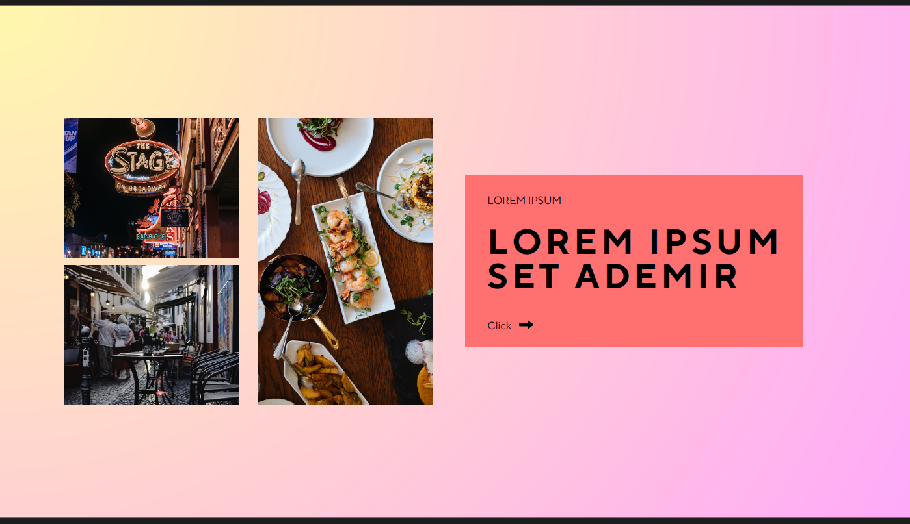
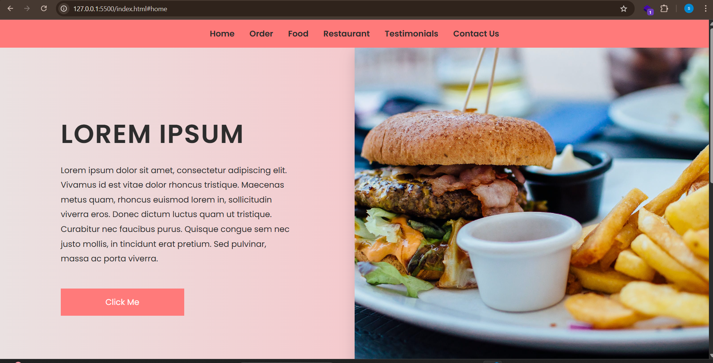
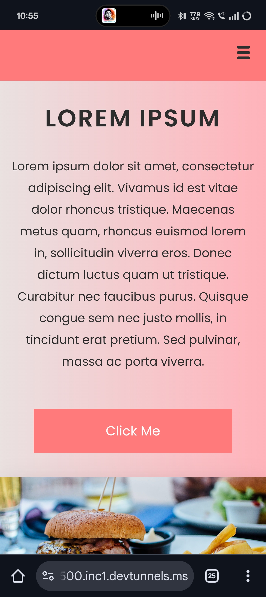
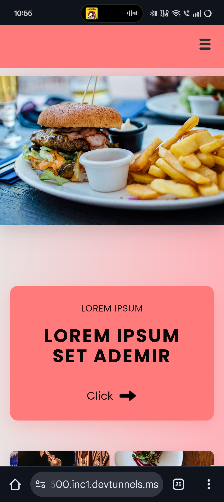
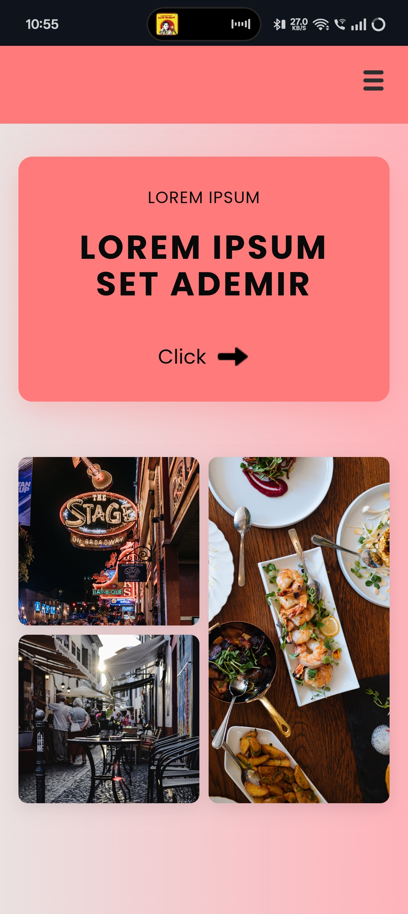

📌 Frontend Responsive Webpage Assignment

This project is a responsive webpage built using HTML and CSS.
The main objective of this assignment was to create a webpage that matches a given design while ensuring responsiveness across desktop, tablet, and mobile devices, and maintaining proper behavior during zooming and resizing.

🎯 Assignment Requirements

✅ The website should match the provided design.

✅ The color scheme must be consistent with the design.

✅ The webpage must be fully responsive across desktop, tablet, and mobile devices.

✅ Images should not get pixelated or stretched.

✅ The layout should not break when zooming in/out or resizing the window.

✅ Text should remain properly aligned and not overflow.

🛠️ Tech Stack

HTML5 → Page structure

CSS3 → Styling, layout, and responsiveness (Flexbox & Media Queries)

📂 Project Structure
.
├── index.html # Main HTML file
├── style.css # CSS styles
├── images/ # Project images (used in design)
└── screenshots/ # Screenshots for demo (desktop, tablet, mobile)

---

## ▶️ How to Run

1. Clone or download this repository.
2. Open `index.html` in your browser.
3. Resize the browser window to test desktop and mobile views.

---

## 📸 Screenshots

(Add your screenshots here — for example:)

### Desktop View

### Mobile View (Menu Closed)

---

---

## 👨‍💻 Author

👨‍💻 Author

This project was developed as part of a Frontend Developer (HTML, CSS) assignment..
